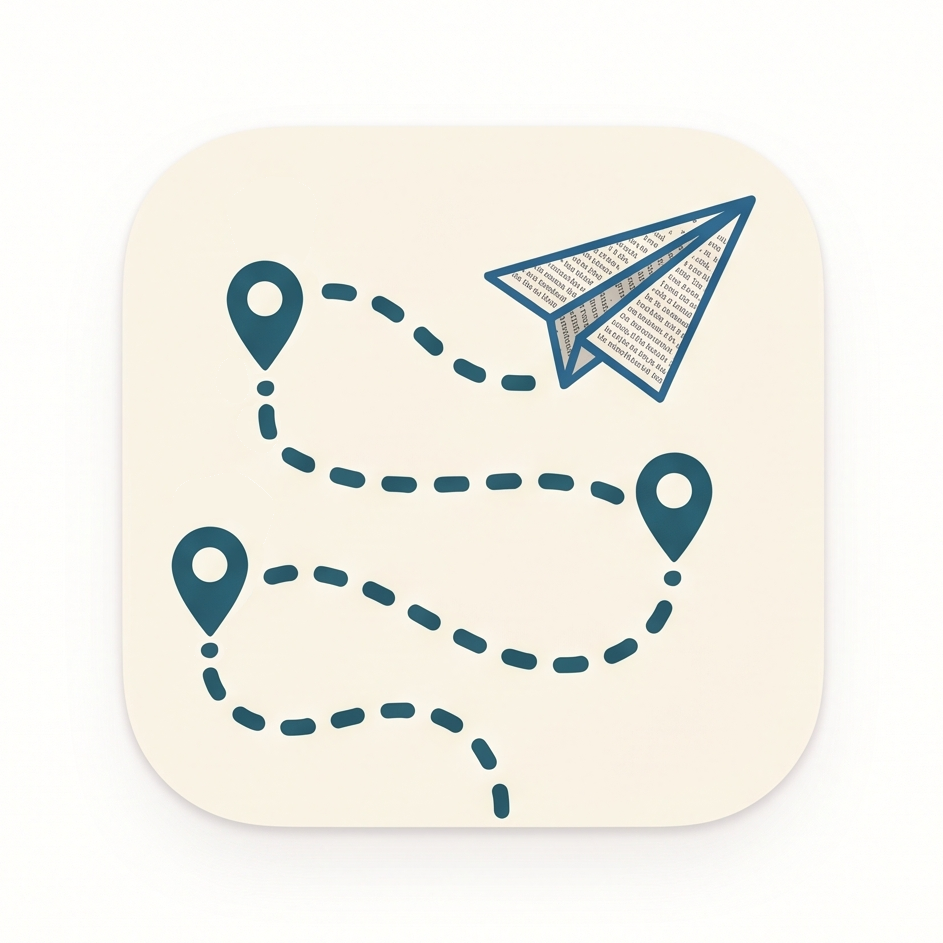

  

# Michigatari

**Michigatari** ("path + story" in Japanese) creates animated map sequences for travel vlogs: capture keyframes on an
interactive map, add animated markers, labels, routes, and region outlines,
and export the result as video. Runs entirely in the browser.

Built with [MapLibre GL JS](https://maplibre.org/) and
[OpenFreeMap](https://openfreemap.org/) tiles. Developed with Claude.

Region search uses [Nominatim](https://nominatim.org/) and road routing uses
the public [OSRM](https://project-osrm.org/) demo server — community-run OSM
services suitable for light personal use only. If you host Michigatari for
others, swap in your own providers (the base URLs live in `src/providers/`).

## Status

Feature-complete v1: author keyframe camera animation with animated markers,
labels, routes, and region outlines, preview with scrubbing, and export to
MP4 (H.264) or WebM (VP9) — 1080p/1440p/4K, 30 or 60 fps, widescreen or
vertical. Everything runs in the browser.

## Development

    npm install
    npm run dev    # the editor
    npm test       # engine unit tests
    npm run build  # production build

License: AGPL-3.0
